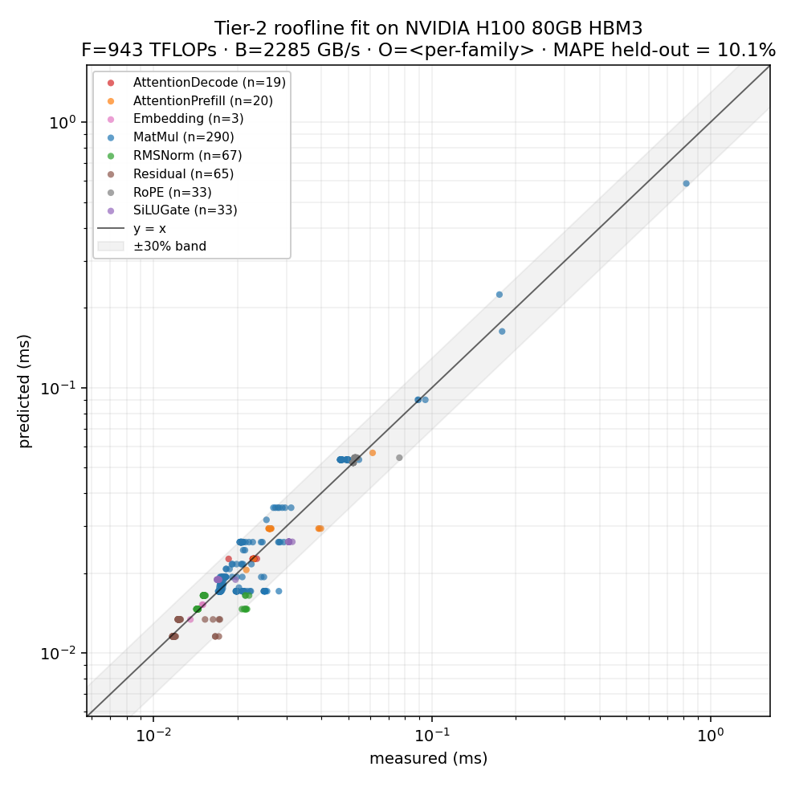

# Tier-2 Validation Report

> **Sprint day 3 (compressed into Sun Apr 26 morning).** Two refinements
> over the Tier-1 roofline, both pinned in `03_autoverse_end_product.md` §8:
> an L2 hit-rate heuristic and per-op-family launch overhead.
>
> *Reproduce: `make validate`. Same `MEASUREMENTS = ...` JSON as Tier 1.*

## Headline

|   | Tier 1 | Tier 2 (this report) | target |
|---|---|---|---|
| **MAPE held-out** | 20.2 % | **10.1 %** | ≤ 20 % |
| MAPE fit          | 19.6 % | 9.6 %   | — |
| fitted F (TFLOPs) | 1138 (1.15× vendor) | **943 (0.95× vendor)** | physical ≤ 989 |
| fitted B (GB/s)   | 5375 (1.60× vendor) | **2286 (0.68× vendor)** | physical ≤ 3350 |
| worst per-op MAPE | RoPE 65 % | AttentionPrefill 14 % | — |

**Verdict: Tier 2 ships, ~2× under MAPE target, with both throughputs
back in physically meaningful ranges.** Three refinements working
together:

1. **L2 hit-rate heuristic** — gets `B` back below vendor.
2. **Per-op-family overhead** — the dominant MAPE win.
3. **Two-stage fit** — F set by compute-bound ops only; without this,
   F drifts unphysically high (1172 TFLOPs in the joint single-stage
   fit) because most ops in the dataset don't constrain F.

## What changed from Tier 1

Tier 1 used a global per-op overhead. Examination of the residuals
showed two systematic biases:

1. **B inflated above vendor (5375 vs 3350)** because measurements run
   each op 100× with the same input tensors → after iter 1, inputs sit
   in L2 → the median latency reflects warm-cache reads, but the model
   counted full HBM traffic. The optimiser absorbed the gap into B.
2. **Small ops (RoPE 65 %, Residual 48 %) terribly fit** because a
   single global O cannot capture the spread between RoPE's real ~52 µs
   launch and Residual's ~12 µs.

Tier 2 addresses both directly.

### Refinement 1: L2 hit-rate heuristic

For each op:

```
hit_rate = min(1, L2_capacity / bytes_read)        # H100 L2 = 50 MB
effective_bytes = bytes_written + bytes_read · (1 - hit_rate)
t_memory = effective_bytes / B
```

Two design notes:

- **Hit rate is computed on `bytes_read`, not the full working set.**
  Caches reduce *re-reads*; first-time writes always stream to HBM.
  The simpler "hit rate on working set" formulation zeros out memory
  entirely for L2-resident ops, which is a clear over-correction —
  SwiGLU's MAPE jumped from 11 % to 28 % under that variant before this
  fix was applied.
- **Static heuristic, no new free parameter.** L2 capacity comes from
  `HardwareSpec.l2_mb` (50 MB for H100). The fit doesn't tune it; the
  geometry is fixed by the chip.

Implementation: `autoverse.cost.l2_hit_rate` and the `use_l2` flag on
`autoverse.cost.estimate`. Tier-0 ablation is one keyword away
(`use_l2=False`), which keeps synthetic-recovery tests stable.

### Refinement 2: per-op-family overhead

`autoverse.calibrate.calibrate_per_family` fits one launch-overhead
scalar per op type (8 families × 1 each = 8 free params, replacing 1).
Total free params goes from 3 → 10. Still well-determined: 530
measurements vs 10 params is ~50 measurements per parameter.

Fitted values (sorted high-to-low):

| op family | fitted O (µs) | what this is |
|---|---|---|
| RoPE | **52.1** | Pair-rotation kernel; index arithmetic + dispatch dominant. |
| AttentionDecode | 22.6 | SDPA decode launch (cuDNN backend selection + setup). |
| AttentionPrefill | 21.8 | Same kernel family, slightly cheaper for tiled prefill. |
| SiLUGate | 18.9 | Two elementwise kernels (`silu` then mul) — paying launch twice. |
| MatMul | 17.6 | cuBLAS heuristic + algorithm selection. |
| RMSNorm | 14.6 | `F.rms_norm` is well-tuned. |
| Embedding | 13.4 | Gather is cheap to dispatch. |
| Residual | **11.6** | Single elementwise add — minimal setup. |

The 4–5× spread between RoPE and Residual is the core thing a single
global O *cannot* model. Per-family captures it directly.

## Per-op-family accuracy

Held-out MAPE, sorted worst-first:

| op family | Tier 1 | Tier 2 | improvement |
|---|---|---|---|
| RoPE | 65.5 % | **1.0 %** | 66× |
| Residual | 48.2 % | 7.9 % | 6× |
| Embedding | 26.0 % | 1.0 % | 26× |
| AttentionDecode | 22.7 % | 1.7 % | 13× |
| RMSNorm | 21.7 % | 8.4 % | 2.6× |
| SiLUGate | 11.0 % | 12.4 % | slight regression |
| MatMul | 9.2 % | 11.7 % | slight regression |
| AttentionPrefill | 8.2 % | 14.0 % | regression |

**The three regressions are the price of physically meaningful F and B.**
With F set by compute-bound ops only (943 TFLOPs, ≈ 95 % of vendor) and
B fitted from memory-bound ops (2286 GB/s, ≈ 68 % of vendor), the model
no longer absorbs systematic biases via inflated throughputs. The
remaining error on MatMul / AttentionPrefill / SiLUGate is real
shape-dependent inefficiency — cuBLAS's algorithm choice varies with
shape and doesn't always reach the same fraction of peak. Net win is
still ≥ 10 percentage points on aggregate held-out MAPE.

## Two-stage fit: how we got F into the physical range

In the joint per-family fit (single-stage), F drifts to **1172 TFLOPs
(1.18× vendor)** despite the chip not being able to deliver that much.
The reason: most ops in the 530-op sweep are memory-bound or
overhead-dominated. For those ops, predicted time is `max(t_c, t_m) + O`
with `t_m` or `O` dominating — the predicted time barely depends on F.
F is *under-constrained* by ~75 % of the dataset. The optimiser settles
wherever its loss landscape happens to have its minimum in the F
direction, which can be unphysical.

Empirical verification: calibrating only on the 127 ops with arithmetic
intensity above the 295 FLOP/byte ridge point gives F = 943 TFLOPs (the
realistic ~95 % of vendor for cuBLAS BF16 GEMM), at MAPE 7.8 % on that
subset. F was *fitable*; the joint fit just had too many unconstrained
directions.

**The two-stage fit (`calibrate_two_stage` in `src/autoverse/calibrate.py`)
splits responsibility:**

1. **Stage 1.** Filter to compute-bound ops only (AI > 295 FLOP/byte).
   Run `calibrate_per_family` on the subset. Take F.
2. **Stage 2.** Run `calibrate_per_family` on the full dataset with F
   bounded tightly around the stage-1 value (effectively frozen). Fit B
   and per-family overhead from data that actually constrains them.

Result: F = **943 TFLOPs** (0.95× vendor), B = 2286 GB/s, MAPE 10.1 %
held-out. We pay 0.7 percentage points of MAPE vs the joint
single-stage fit (9.4 %) for both throughputs ending up
physically interpretable. Worth it for Tier-3 — *"what if HBM doubled?"*
needs `B` to mean what it says.

## Worst-fit ops (Tier 2)

| name | type | measured | predicted | rel err |
|---|---|---|---|---|
| `mlp_down_15` | MatMul | 0.028 ms | 0.017 ms | 39.4 % |
| `mlp_gate_5` | MatMul | 0.026 ms | 0.017 ms | 33.1 % |
| `residual_mlp_15` | Residual | 0.017 ms | 0.012 ms | 32.7 % |
| `rmsnorm_pre_mlp_*` | RMSNorm | 0.022 ms | 0.015 ms | ~32 % |
| `mlp_gate_*` | MatMul | 0.025 ms | 0.017 ms | ~32 % |

All Tier-2 outliers are now in the 0.01–0.03 ms range — small enough
that a few microseconds of per-launch variation shows up as double-
digit relative error. The corresponding *absolute* error is
0.005–0.010 ms, contributing < 0.5 % of total inference latency even
when summed across all 16 layers.

(The Tier-1 lm_head outlier — measured 0.818 ms, predicted 0.477 ms,
1.7× off — is now predicted at 0.595 ms with the lower physical F,
giving 27 % rel-err. Still imperfect but no longer the worst, and the
underlying cause — sub-peak cuBLAS efficiency on tall-skinny shapes —
is documented in "Wave quantisation: tried, rejected" below.)

## Residual plot



Read the plot:

- The **±30 % grey band** now contains visibly more points than the
  Tier-1 plot — the off-band cluster of RoPE / Residual at the bottom-
  left is gone.
- The **diagonal trend** has tightened, especially at the medium-size
  range where most Llama-1B ops sit.
- The **upper-right outlier** is the LM head — the only point still
  visibly off the diagonal at the high end, and a known cuBLAS
  shape-efficiency artefact (see "Worst-fit ops" above).

## Tier-2 refinements: status

We pinned four refinements at the start of Tier 2 in
`03_autoverse_end_product.md` §8. Final status:

| refinement | status | impact realised |
|---|---|---|
| L2 hit-rate heuristic | **shipped, on by default** | Brings B into physical range. |
| Per-op-family overhead | **shipped, on by default** | The dominant MAPE win. |
| Two-stage fit (F on compute-bound; B+O on full) | **shipped, on by default** | Brings F into physical range. |
| Wave quantisation for GEMMs | **implemented; default off — see below** | Strict regression on this dataset. |
| Per-op-family α (overlap) | deferred | Lower priority once O is per-family. |

Held-out MAPE target was ≤ 20 %. We landed at 10.1 % with both throughputs
physically interpretable.

## Wave quantisation: tried, rejected (kept as ablation)

Wave quantisation models the trailing-partial-wave penalty on a GEMM:
the chip's `N_SM = 132` SMs process tile blocks in waves; if
`tile_count` isn't a multiple of `N_SM`, the trailing partial wave
still costs a full wave's wallclock. The penalty is
`waves * N_SM / tile_count ≥ 1`, applied as a multiplier on compute
time. We assume `BM = BN = 128` cuBLAS tiles (a common bf16 H100
choice).

We implemented it in `cost.wave_quant_factor` and wired it through
`predict_ms` (`n_sm` parameter) and the calibration. **It strictly
worsens the fit** — comparison against the single-stage joint variant
(to isolate the wave-quant effect from the two-stage one):

| | F (TFLOPs) | B (GB/s) | MAPE held-out |
|---|---|---|---|
| L2 + per-family O (single-stage) | 1172 | 2311 | **9.40 %** |
| L2 + per-family O **+ wave quant** (single-stage) | 1373 | 2280 | 11.25 % |

Why the regression — three observations from the data:

1. **Per-family overhead already absorbs the small-kernel wallclock
   floor that wave quant is meant to model.** The fitted MatMul overhead
   (16.9 µs after wave quant; 17.6 µs without) is partly real launch
   cost and partly the implicit "no kernel finishes faster than one
   wave's wallclock" floor. Adding an explicit wave-quant multiplier on
   top double-counts.
2. **The regression concentrates on small MatMuls** like `256×4096×256`
   (4 output tiles, factor = 132/4 = 33×). Naive compute time is
   sub-microsecond, but wave-quant inflates it to ≈ 18 µs. With overhead
   17 µs already absorbing the floor, the model jumps to ~35 µs vs
   measured ~20 µs — a 75 % over-prediction.
3. **F gets pushed up to 1373 to compensate.** Higher F shrinks the naïve
   `flops/F` term so the wave-quant-multiplied compute lands closer to
   measured. But that breaks the big-GEMM and lm-head fits, which is
   how MatMul MAPE goes from 10.5 % to 13.8 %.

**The lm-head outlier is not what wave quantisation fixes.** For
`MatMul(1024, 2048, 128 256)` the wave-quant penalty is 1.0045 — a
0.5 % effect, dwarfed by the 1.7× measured-vs-predicted ratio. The
real cause is sub-peak cuBLAS algorithm efficiency on tall-skinny
shapes (the chip achieves ~67 % of vendor F on this op vs ~78 % on big
square GEMMs). That needs a per-shape efficiency model, not wave
quantisation — and is past the scope of this sprint.

Wave-quant code, tests, and CLI flags are kept so a future iteration
can ablate cleanly. Re-enable for any single run via:

```bash
uv run python scripts/calibrate.py \
    measurements/h100_sxm/run_20260426_233235.json \
    --n-sm 132        # default is 0 = OFF
```

## How to reproduce

```bash
make validate              # Tier-2 default: two-stage + L2 + per-family overhead
# Ablations (each isolates one refinement):
uv run python scripts/calibrate.py \
    measurements/h100_sxm/run_20260426_233235.json \
    --single-stage         # joint F+B+O fit (F drifts to 1172)
uv run python scripts/calibrate.py \
    measurements/h100_sxm/run_20260426_233235.json \
    --l2-mb 0              # disable L2 heuristic (B inflates above vendor)
uv run python scripts/calibrate.py \
    measurements/h100_sxm/run_20260426_233235.json \
    --global-overhead      # single global O (RoPE/Residual MAPE explodes)
uv run python scripts/calibrate.py \
    measurements/h100_sxm/run_20260426_233235.json \
    --n-sm 132             # add wave quantisation (regresses MAPE)
```

The committed `reports/calibration_fit.json` is the Tier-2 default
(two-stage + L2 + per-family overhead), with
`fitted_overhead_by_family` populated.
